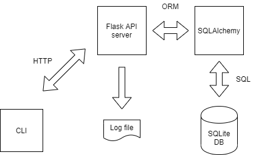

# Taskman

Taskman is a simple application to manage a list of tasks 

## Installation

### Clone git repository
```
git clone https://github.com/ivtikhon/taskman.git
```
### Install prerequisites
```
cd taskman
sudo apt-get -y install python3
sudo apt-get -y install python3-pip
pip3 install flask
pip3 install flask-sqlalchemy
pip3 install flask-testing
pip3 install tabulate
```
### Run unit tests
```
python3 tests.py
```
### Start server
```
python3 startsever.py
```

## Implemetation details

The application is written in Python using [Flask](https://palletsprojects.com/p/flask/) framework. The command line interface communicates through HTTP with an application server that manages a list of tasks stored in a database. All operations on tasks are logged to a file. The application server and logging parameters are stored in a configuration file. The default database engine is [SQLite](https://www.sqlite.org/), though easily reconfigurable.

### Architecture diagram

#### Arconyms on picture:
* HTTP - hypertext transfer protocol
* ORM - object relational mapper
* SQL - structured query language
* API - application program interface

## Usage
### List tasks
```
python3 taskman.py list
```
### List tasks expiring today or already expired
```
python3 taskman.py list --expiring-today
```

### Add a task
```
python3 taskman.py add "Develop Python program" "4/30/20"
```
### Close a task
```
python3 taskman.py done 4
```

## Examples
```
$ python3 taskman.py list
  Id  Subject                                                    Due date
----  ---------------------------------------------------------  ----------
   3  Migrate SQL databases to cloud                             06/22/2020
   5  Read about class inheritance model in Python               05/17/2020
   6  Collect input from stakeholders for weekly status meeting  04/08/2020
   7  Take a C# training course                                  03/05/2020

$ python3 taskman.py done 5
$ python3 taskman.py list
  Id  Subject                                                    Due date
----  ---------------------------------------------------------  ----------
   3  Migrate SQL databases to cloud                             06/22/2020
   6  Collect input from stakeholders for weekly status meeting  04/08/2020
   7  Take a C# training course                                  03/05/2020

$ python3 taskman.py add "Update environment definition file" "5/13/2020"
$ python3 taskman.py list
  Id  Subject                                                    Due date
----  ---------------------------------------------------------  ----------
   3  Migrate SQL databases to cloud                             06/22/2020
   6  Collect input from stakeholders for weekly status meeting  04/08/2020
   7  Take a C# training course                                  03/05/2020
   8  Update environment definition file                         05/13/2020

```